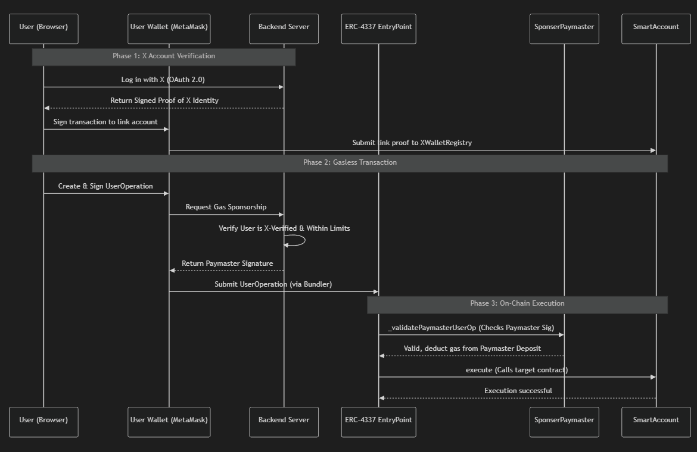

# 𝕏-Wallet Web3: Social Identity meets Account Abstraction

[](https://opensource.org/licenses/MIT)
[](https://book.getfoundry.sh/)
[](https://eips.ethereum.org/EIPS/eip-4337)

**X-Wallet** is a next-generation Web3 wallet system designed to bridge the gap between Social Media Identity and Blockchain Security. By leveraging **Account Abstraction (ERC-4337)**, it provides a seamless, gasless, and human-readable experience for everyday users.

---

## 🚀 Key Features

*   **🔗 Identity Linking**: Link your **X (Twitter) username** to your Ethereum address on-chain via the `XWalletRegistry`. This makes your wallet human-readable and verified.
*   **⛽ Gasless Transactions**: Send transactions (tokens, contract calls) **without holding any ETH**. A `SponsorPaymaster` contract handles the gas fees for you.
*   **📱 Web2-Style Experience**: Authenticate using official **X OAuth 2.0**. No complex private keys or seed phrases needed for identity verification.
*   **🛡️ Institutional Security**: Smart accounts are controlled by your EOA but execute through the highly secure ERC-4337 EntryPoint protocol.

---

## 🏗️ Architecture



The system consists of three main layers:
1.  **Smart Contracts (Solidity)**: The core logic for identity, account management, and gas sponsorship.
2.  **Backend (Node.js)**: Orchestrates X OAuth verification and signs gas sponsorships.
3.  **Frontend (React/Vite)**: A premium, glassmorphism-inspired dashboard for users.

---

## 🛠️ Technology Stack

| Component | Technology |
| :--- | :--- |
| **Smart Contracts** | Solidity, Foundry, OpenZeppelin |
| **Backend** | Node.js, Express, Ethers.js (v6), JWT |
| **Frontend** | React, Vite, Tailwind CSS, Lucide Icons |
| **Identity** | X (Twitter) OAuth 2.0 PKCE |
| **Protocol** | ERC-4337 (Account Abstraction) |

---

## 📂 Project Structure

```text
x-wallet-web3/
├── src/                # Solidity Smart Contracts
│   ├── XWalletRegistry.sol     # User-Identity mapping
│   ├── SmartAccount.sol        # User's contract wallet
│   ├── SmartAccountFactory.sol # CREATE2 account deployment
│   └── SponsorPaymaster.sol    # Gas sponsorship logic
├── backend/            # Express Server (Auth & Bundling)
├── frontend/           # React Application (Dashboard)
├── script/             # Deployment & Interaction Scripts
└── test/               # Foundry Unit & Integration Tests
```

---

## 🚦 Getting Started

### 1. Smart Contracts
```bash
# Install dependencies
forge install

# Build & Test
forge build
forge test
```

### 2. Backend Setup
```bash
cd backend
npm install
npm run dev
```

### 3. Frontend Setup
```bash
cd frontend
npm install
npm run dev
```

---

## 📜 Core Workflow

### 1. Identity Linking
The `XWalletRegistry` verifies backend signatures to establish a permanent on-chain link between a wallet and an X handle.

```solidity
function linkUsername(string calldata username, string calldata xUserId, bytes32 nonce, uint256 expiry, bytes calldata backendSig) external {
    // Verifies backend signature and stores mapping
}
```

### 2. Gas Sponsorship
The `SponsorPaymaster` validates that the user is verified on X before agreeing to pay for their transaction gas.

```solidity
function _validatePaymasterUserOp(PackedUserOperation calldata userOp, bytes32 userOpHash, uint256 maxCost) internal override returns (bytes memory context, uint256 validationData) {
    // Recovers backend signature and checks user limits
}
```

---

## 📄 License
This project is licensed under the **MIT License**.

---

Developed with ❤️ by the X-Wallet Team.
